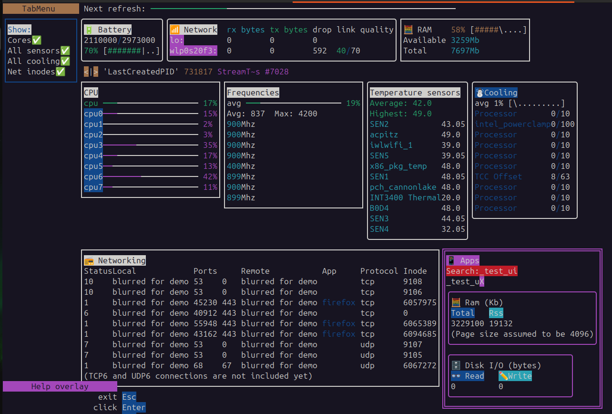
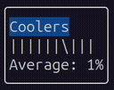
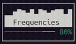

# 🐧 live-stats-for-linux-based-operating-systems-in-mojo
## Early development, please double check the metrics with other tools!

This app will run on 🐧 linux based OS, and is created in the 🔥 Mojo programming language.  
It can be thought of as an overview of metrics with 🔍 variable level of details.  

The reasons i'm building this is:  
- Test and improve my work in progress UI framework: [ui-terminal-mojo](https://github.com/rd4com/ui-terminal-mojo)  
- Showcase the ui  
- Create something useful  
- Learn a little about linux based operating systems  
- Have something to show when looking for a job  

It is important to say that i'm not an expert in any of theses things.  
That is a lot of `I`, but the central idea is about creating something useful for you.  

Over time, an `Trait` to simply add custom panels will be added,  
that way, folks like me can create their pannels for gpus, containers, ..  

Rules that guide this project:  
- No extra dependencies  
- Open-source  

Why? So that people can:  
- use this  
- change this  

How?  
- easily  

Constraints:  
- Time  

If you'd like to heavily customize/change this,  
feel free to clone, this is why it is open-source.  

───────────────────────────────────────────────────────────────────────────────  
For people customizing:  
The ui-framework can be thought of as an +- 30/60 FPS loop,  
so don't do I/O in the loop,  
or anything that should not be done many times per second.  

Hopefully the code is self-explanatory,  
there are some quirks in the UI tho, see the repo.  
───────────────────────────────────────────────────────────────────────────────  

# How the app look like:

  

# Latest improvements:

### 🆕 [app_progressive](./app_progressive.mojo)
More user-friendly, progressive complexity, "Things shown only when needed".  
This is what the ui framework should be able to to more and better over time.

### 🆕 `GPU agnostic pannel` with customizable metric fetcher
Defaults to dummy data,  
just customize this [`Dummy_GPU_metric_fetcher.mojo`](./Dummy_GPU_metric_fetcher.mojo) to integrate any GPU!  

The pannel only consume CSV with an specific format,  
users can just create an shell script that get metrics from whatever source their GPU provide,  
and format it to the expected CSV format.  

Why? because some GPUs might not have tools but virtual files for example.  
This way, the app can support any of the many brand of GPUs, maybe even remote ones !  
Also, it would be difficult to bring all the dependencies to support every gpus.  

So the app call that function each second to get CSV metrics (`String`),  
and show the results in an hopefuly beautiful way in the pannel.  
Users need to customize that function if they need real metrics,  
because defaults are dummy.

The feature is here for y'all,  
thanks to 'apnea' from the forum for asking for it.  

Next step might be to integrate `async` multithread with `SpinLock` :p
(For all CPU metrics too)  

  
### Widgets:


&nbsp;
  

# How to get the app:

```bash
git clone --recursive https://github.com/rd4com/live-stats-for-linux-based-operating-systems-in-mojo
cd live-stats-for-linux-based-operating-systems-in-mojo
cd ui-terminal-mojo
pixi shell
pixi run build_pkg
cd ..
mojo build app.mojo -I ui-terminal-mojo/build
```
This create the app, to run it:
```bash
./app
```
(Change to `app_progressive.mojo` for the progressive flavour of `app.mojo`)  

Why the ui is not an community-package yet ?  
because not sure yet if the ui framework is good enough,  
hopefully, developing apps like this can help answer that.  

═══════════════════════════════════════════════════════════════════════════════  

🫶 Thanks to many people in the 🔥 mojo forum & chat for:  
- Feedbacks  
- Encouragements to work on this.  
- Encouragements to create an repo.  

═══════════════════════════════════════════════════════════════════════════════  

If you'd like to say "I like where this is going" to encourage more work,  
just 🌟 star the repo !  

&nbsp;

> MAX and Mojo usage and distribution are licensed under the [MAX & Mojo Community License](https://www.modular.com/legal/max-mojo-license)
