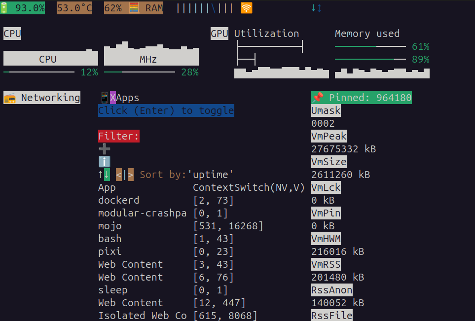
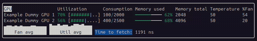

# 🐧 live-stats-for-linux-based-operating-systems-in-mojo
*(Early development, please double check the metrics with other tools!)*  

This app will run on 🐧 linux based OS, and is created in the 🔥 Mojo programming language.  
It can be thought of as an overview of metrics with 🔍 variable level of details.  

- Context  
- Progressive complexity
- **"Things shown only when needed".**  

&nbsp;

Ergonomical:  
1. Move with arrow keys  
2. Accelerate holding shift  
3. Click with Enter  

Friendly:  
- Choose the current level of details for any part  
- Default to less details  

Powerful:
- Advanced stats available  
- Explore and unlock new paths  

Unifying:  
- CPU & GPU  
- Networks & Networkers  
- Sensors & Coolers  
- Ram & Swap  

&nbsp;

Status: *work-in-progress, thinking, design, ..*  

&nbsp;

**feel free to clone**, this is open-source!  
If it helps you build something great,  
that’s exactly what it’s here for.  


(Small dev note):
The ui-framework is an +- 30/60 FPS loop,  
so don't do I/O or anything that should not be done many times per second.  

&nbsp;

# How the app look like:

  

Info: ➡️ Many things changes since `app_before.mojo`:
  

# Latest improvements:

### 🆕 `GPU agnostic pannel` with customizable metric fetcher
Defaults to dummy data,  
just customize this [`Dummy_GPU_metric_fetcher.mojo`](./Dummy_GPU_metric_fetcher.mojo) to integrate any GPU!  

  

The pannel only consume CSV with an specific format,  
users can just create an shell script that get metrics from whatever source their GPU provide,  
and format it to the expected CSV format.  

Why? because some GPUs might not have tools but virtual files for example.  
This way, the app can support any of the many brand of GPUs, maybe even remote ones !  
Also, it would be difficult to bring all the dependencies to support every gpus.  

So the app call that function each second to get CSV metrics (`String`),  
and show the results in an hopefuly beautiful way in the pannel.  
Users need to customize that function if they need real metrics,  
because defaults are dummy.

The feature is here for y'all,  
thanks to 'apnea' from the forum for asking for it.  

Next step might be to integrate `async` multithread with `SpinLock` :p
(For all CPU metrics too)  

  
### Widgets:


&nbsp;
  

# ▶️ How to get the app:

```bash
git clone --recursive https://github.com/rd4com/live-stats-for-linux-based-operating-systems-in-mojo
cd live-stats-for-linux-based-operating-systems-in-mojo
cd ui-terminal-mojo
pixi shell
cd ..
mojo build app.mojo
```
This create the app, to run it:
```bash
./app
```


═══════════════════════════════════════════════════════════════════════════════  

🫶 Thanks to many people in the 🔥 mojo forum & chat for:  
- Feedbacks  
- Encouragements to work on this.  
- Encouragements to create an repo.  

═══════════════════════════════════════════════════════════════════════════════  

If you'd like to say "I like where this is going" to encourage more work,  
just 🌟 star the repo !  

&nbsp;

> MAX and Mojo usage and distribution are licensed under the [MAX & Mojo Community License](https://www.modular.com/legal/max-mojo-license)
